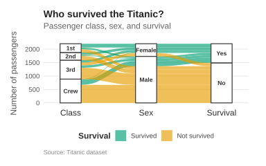

## Basic

An alluvial plot shows how observations are distributed and connected across several categorical variables, with thicker bands representing larger groups. This makes it possible to see how different categories combine and how the composition of groups changes from one variable to the next. Alluvial plots are particularly useful when the relationships between several categorical variables are more important than the individual observations.


The following plot uses an alluvial plot to examine Titanic passenger survival by passenger class and sex. The bands connect passenger class → sex → survival, with the thickness of each band showing how many passengers belong to that combination of categories. The colors distinguish the two survival outcomes.


```r
!r(plot01.R)
```


