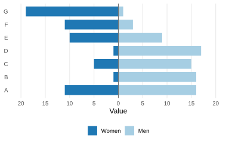

## Basic

A back-to-back bar plot compares the values of two groups across the same set of categories by placing their bars on opposite sides of a common central axis. This makes it easy to compare the magnitude and direction of differences between the two groups within each category, while also revealing patterns across categories.


The following plot uses a back-to-back bar plot to show the values for men and women across different dimensions. Each bar represents the value for one group within a dimension, with men shown on one side of the central axis and women on the other. The length of each bar indicates the magnitude of the value, while the different colors distinguish the two groups. The plot makes it easy to compare men and women within each dimension and to see how the values vary across dimensions.

```r
!r(plot01.R)
```


