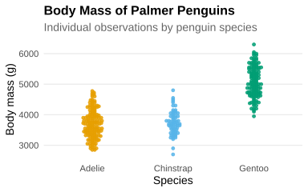
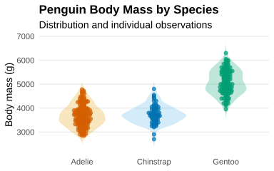

## Basic

A **bee swarm plot** displays individual observations for each category, with points arranged to reduce overlap and make the distribution easier to see. Some observations may still overlap, but the layout can reveal patterns that are difficult to distinguish when many points are simply plotted on top of each other. Bee swarm plots can therefore be a useful alternative or complement to more compact summaries such as boxplots.

The following plot uses a bee swarm plot to compare the **body mass of penguins across the three species** in the Palmer Penguins dataset. Each point represents an individual penguin, while the different colors distinguish the species.

```r
!r(bees01.R)
```



## Violin

The next plot combines a violin plot with a bee swarm plot, allowing us to see both the overall distribution of body mass for each species and the individual observations within those distributions.

```r
!r(bees02.R)
```



