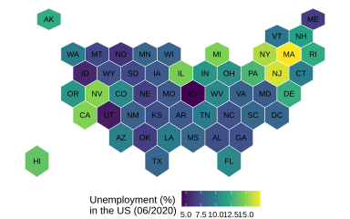

## Basic

A hexagon plot represents geographic areas as equally sized hexagons, with color indicating the value of a variable in each area. This makes it easy to compare values across regions and identify spatial patterns or differences.


The following plot uses a hexagon plot to examine unemployment rates across US states in June 2020. Each hexagon represents a state, with the color intensity showing the unemployment rate and state abbreviations providing geographic labels. The hexagonal layout gives each state a consistent visual area, making it easier to compare unemployment levels across states while highlighting broader spatial patterns.


```r
!r(plot01.R)
```


