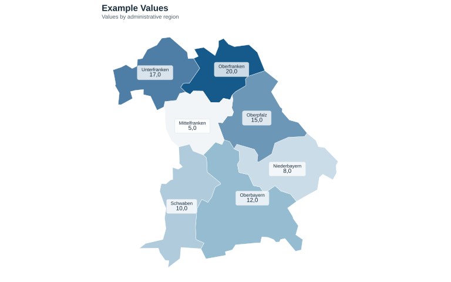

## Main

Maps provide a clear way to visualise how a variable varies across geographic areas, using colour, shading, symbols, or labels to reveal spatial patterns and differences at a glance; a choropleth map is particularly useful when the data are associated with defined administrative or statistical areas.

 The example map shows the **seven administrativ regions of Bavaria** — and uses colour intensity to represent the value of an example indicator in each region, with the corresponding value displayed directly on the map.


```r
!r(plot01.R)
```


