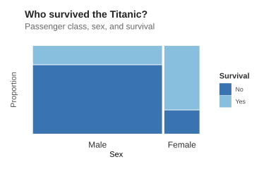

## Basic

A mosaic plot is used to explore relationships between categorical variables. Each tile represents a combination of categories, and the size of the tile shows how common that combination is. This makes it easy to compare groups and see differences in proportions across categories.
In the Titanic example, the mosaic plot shows the relationship between sex and survival. The width of each section represents the number of passengers in each sex category, while the height of the survival sections shows the proportion who survived or did not survive. The numbers inside the tiles give the actual number of passengers in each group.


```r
!r(plot01.R)
```


