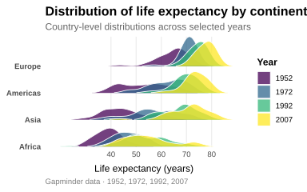

## Basic

A ridge plot displays multiple probability distributions along a shared axis, using overlapping density curves to make differences in location, spread, skewness, and shape across groups easy to compare. The ridges can also incorporate additional variables through aesthetics such as color or fill, allowing the plot to show how distributions change across time or other meaningful categories without relying on separate panels.

In our Gapminder example, each ridge represents the distribution of life expectancy across countries within a continent, while the four colors represent selected years (1952, 1972, 1992, and 2007). This makes it possible to see how life expectancy distributions shifted over time within each continent, while also revealing differences in their overall shape and spread.


```r
!r(plot01.R)
```


