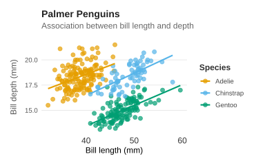
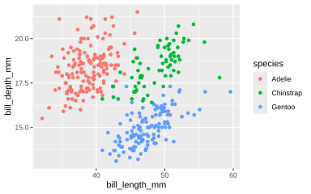
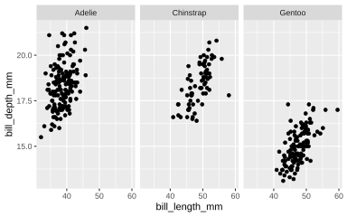

## Basic

A scatter plot displays individual observations as points positioned according to two numerical variables, making it easy to explore relationships, patterns, clusters, and potential outliers between them.


The following plot uses a scatter plot to show the relationship between bill length and bill depth for penguins in the Palmer Penguins dataset. Each point represents an individual penguin, with its position determined by the length and depth of its bill. The plot can help reveal patterns in the relationship between these two measurements and how individual penguins are distributed across the observed values.

```r
library(ggplot2)
library(palmerpenguins)

ggplot(penguins, aes(x = bill_length_mm, y = bill_depth_mm)) +
  geom_point()

```



## Colored

A colored scatter plot shows the relationship between bill length and bill depth, with colors distinguishing the three penguin species. Each point represents an individual penguin.

```r
library(ggplot2)
library(palmerpenguins)

ggplot(penguins, aes(bill_length_mm, bill_depth_mm, color = species)) +
  geom_point()
```



## Faceted

A faceted scatter plot shows bill length and bill depth separately for each penguin species, making it easier to compare their distributions and relationships side by side.

```r
library(ggplot2)
library(palmerpenguins)

ggplot(penguins, aes(bill_length_mm, bill_depth_mm)) +
  geom_point() +
  facet_wrap(~species)
```


