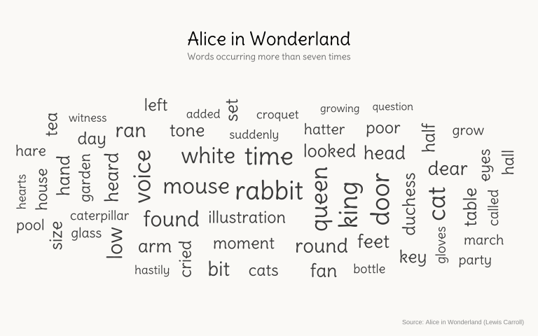

## Basic

Word clouds provide a visual overview of the most prominent words in a text, with word size indicating how often each word appears. They are useful for spotting recurring themes and patterns at a glance, although they are better suited to exploration than precise comparisons of word frequencies.

 The Alice in Wonderland plot shows the most frequently occurring words in the story after common stop words and “alice” have been removed. Larger words appear more often in the text, offering a visual impression of the language and vocabulary that characterize the story.


```r
!r(plot01.R)
```


