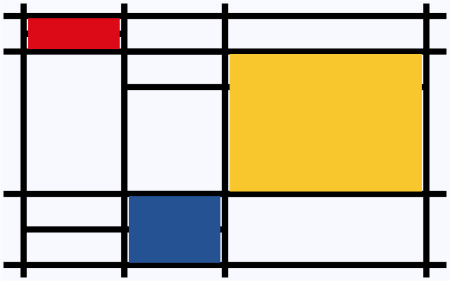
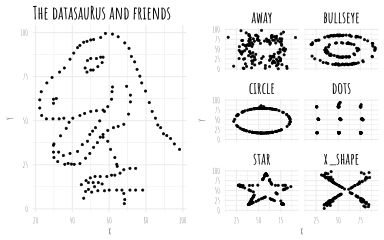
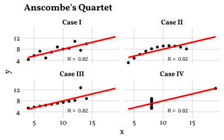

## Mondrian

Piet Mondrian was a Dutch painter and a major figure in the development of abstract art. During his Paris period (1911–1938), he progressively moved away from representational painting toward a highly reduced visual language of vertical and horizontal lines, geometric forms, and primary colours.

In the 1920s, his mature style became associated with De Stijl and Neoplasticism: compositions were constructed from black lines and white fields, with carefully balanced areas of red, blue, and yellow. Rather than depicting objects, Mondrian sought what he described as a universal visual order based on relationships between line, proportion, colour, and space.

The R code creates a generative interpretation of Mondrian's Paris-period compositions. It uses randomly generated horizontal and vertical structures, strong black lines, and small areas of primary colour to explore the balance and rhythm between line, proportion, colour, and empty space.


```r
!r(mondrian.R)
```




## Datasaurus

 Datasaurus is a dataset that shows how **summary statistics can hide the true structure of data**. It demonstrates that different datasets can have similar statistical properties but look completely different when visualized, highlighting the importance of **plotting data before drawing conclusions**. You can find more information on the **Datasaurus Dozen** on  Matejka and Fitzmaurice’s paper "Same Stats, Different Graphs: Generating Datasets with Varied Appearance and Identical Statistics through Simulated Annealing".


```r
!r(datasaurus.R)
```



## Anscombe

 Anscombe’s Quartet is a set of **four datasets that have nearly identical summary statistics but look very different when plotted**. It demonstrates why **visualizing data is important**, as averages and correlations alone can hide important patterns, outliers, and relationships.


```r
anscombe_m <- data.frame()
sysfonts::font_add_google("Vollkorn", "Vollkorn")
showtext::showtext_auto()

for (i in 1:4) {
  anscombe_m <- rbind(anscombe_m, data.frame(
    set = i,
    x = anscombe[, i],
    y = anscombe[, i + 4]
  ))
}

anscombe_m <- anscombe_m |>
  dplyr::mutate(set_new = dplyr::case_when(
    set == 1 ~ "Case I",
    set == 2 ~ "Case II",
    set == 3 ~ "Case III",
    set == 4 ~ "Case IV"
  ))


anscombe_plot <- ggplot2::ggplot(anscombe_m, ggplot2::aes(x, y)) +
  ggplot2::geom_point(size = 1.5, color = "black", fill = "black", shape = 21) +
  ggplot2::geom_smooth(method = "lm", fill = NA, fullrange = TRUE, color = "red", alpha = 0.5) +
  ggplot2::facet_wrap(~set_new, ncol = 2) +
  cowplot::theme_minimal_grid() +
  ggplot2::labs(
    title = "Anscombe's Quartet",
    alt = "www.edgar-treischl.de"
  ) +
  ggplot2::theme(strip.text.x = ggplot2::element_text(
    size = 12, color = "black", face = "bold"
  )) +
  ggplot2::annotate(
    x = 12.5, y = 4.45,
    label = paste("R = ", round(cor(
      anscombe_m$x,
      anscombe_m$y
    ), 2)),
    geom = "text", size = 3
  ) +
  ggplot2::theme(text = ggplot2::element_text(family = "Vollkorn"))

anscombe_plot
```




