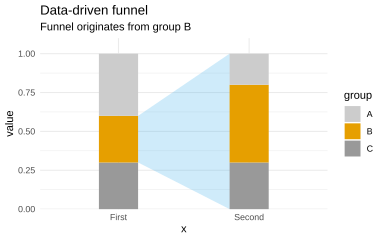
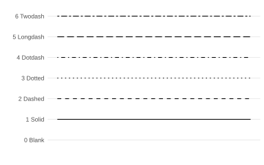
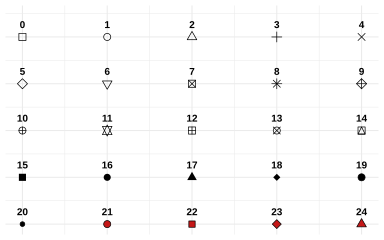

## Funnel

Use such a funnel when you want to **visually connect a specific segment of one stacked bar to a target distribution** in another bar. 

### In a Nutshell

1. Define the **source**, **target**, and **source group**.

2. Calculate the stacked-bar boundaries (`ymin` and `ymax`).

3. Identify the vertical position of the selected source group.

4. Create a polygon connecting that segment to the target bar.

5. Overlay the semi-transparent funnel on the stacked bars.

**Reusable for:** showing flows, transitions, cohort movement, proportions, or how one segment relates to a subsequent distribution.


```r
!r(funnel.R)
```




## Linetypes


```r
!r(show.R)
```




## Shapetypes


```r
!r(show.R)
```




